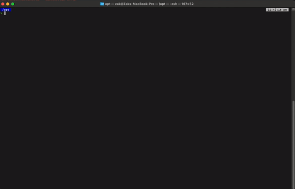

# Script that gueses phishing domains using the new .ZIP TLD.


## Example command
``` bash
> python3 zip-phishing-domain.py 
```
## Example Output
```bash
http://account-deactivation.zip - Connection Error
http://account-suspension.zip - Connection Error
http://account-verification.zip - Connection Error
http://accounts.zip - 200
http://annual-report.zip - Connection Error
```
